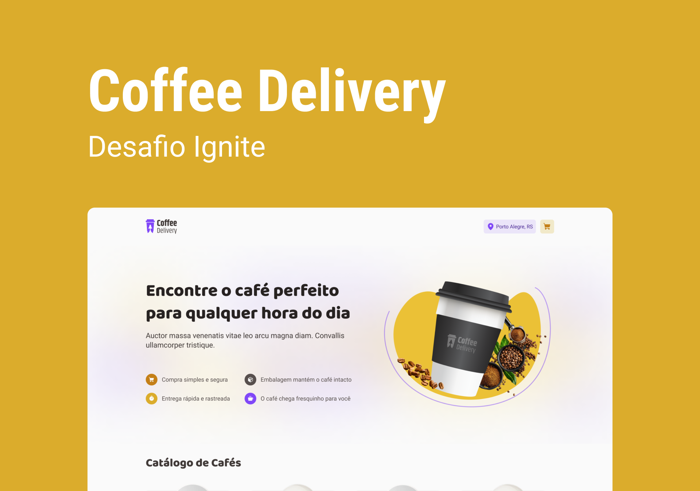

<div align='center'>
  
</div>

<h1 align='center'>
Coffee Delivery
</h1>

<h4 align='center'>
Desafio 2 - Ignite 2022 🚀
</h4>

 # 💻 Projeto
 
Loja on-line de cafés com a opção de delivery, onde o usuário adiciona ao carrinho de compras um ou mais dos produtos disponíveis e solicita a compra preenchendo o formulário com o endereço de entrega.

A aplicação foi desenvolvida com React + Typescript e como desafio do módulo 2 do bootcamp Ignite - 2022. Neste projeto foi aplicado diversos conhecimentos visto no módulo como: Context API, layout default, rotas, formulários com React-Hook-Form, hooks (useState e useEffect), além dos fundamentos básicos da ferramenta como por exemplo a componentização.

O Projeto também foi desenvolvido do total zero, apenas seguindo o layout proposto na plataforma do Figma, seguindo arrisca todos os paramentros de cores, tamanho das fontes, espaçamento e estados em que cada elemento possa assumir na aplicação, além de, ter sido incluído alguns elementos a mais a fim de enriquecer o projeto.

Por fim, durante o desenvolvimento foi também seguindo o conceito de "Mobile-First" e adaptando a aplicação para telas maiores quando necessário.
 
 # 🧪 Tecnologias

Esse projeto foi desenvolvido com as seguintes principais tecnologias:
- [ReactJS](https://pt-br.reactjs.org/);
- [ViteJS](https://vitejs.dev/);
- [Typescript](https://www.typescriptlang.org/);
- [Context API](https://pt-br.reactjs.org/docs/context.html);
- [React Router Dom](https://v5.reactrouter.com/web/guides/quick-start);
- [React Hook Form](https://react-hook-form.com/);
- [React Toastify](https://www.npmjs.com/package/react-toastify);
- [Scroll Reveal](https://scrollrevealjs.org/);
- [Styled Components](https://styled-components.com/);
- [Zod](https://github.com/colinhacks/zod);

# 🚀 Como executar

Clone o projeto e acesse a pasta do mesmo.

```bash
$ git clone https://github.com/rogerrm95/coffee-delivery.git
$ cd coffee-delivery
```
Para iniciá-lo, siga os passos abaixo:
```bash
# Instalar as dependências
$ yarn

# Iniciar o projeto
$ yarn start
```
O app estará disponível no seu browser pelo endereço http://localhost:3000.

# 🎨 Layout
Você pode visualizar o layout do projeto através do link abaixo:
- [Layout Web](https://www.figma.com/file/2TktBsxzBlrsXwM7bVl6hm/Coffee-Delivery) (Lembrando que você precisa ter uma conta no Figma).

# 📃 License
[MIT](https://choosealicense.com/licenses/mit/)